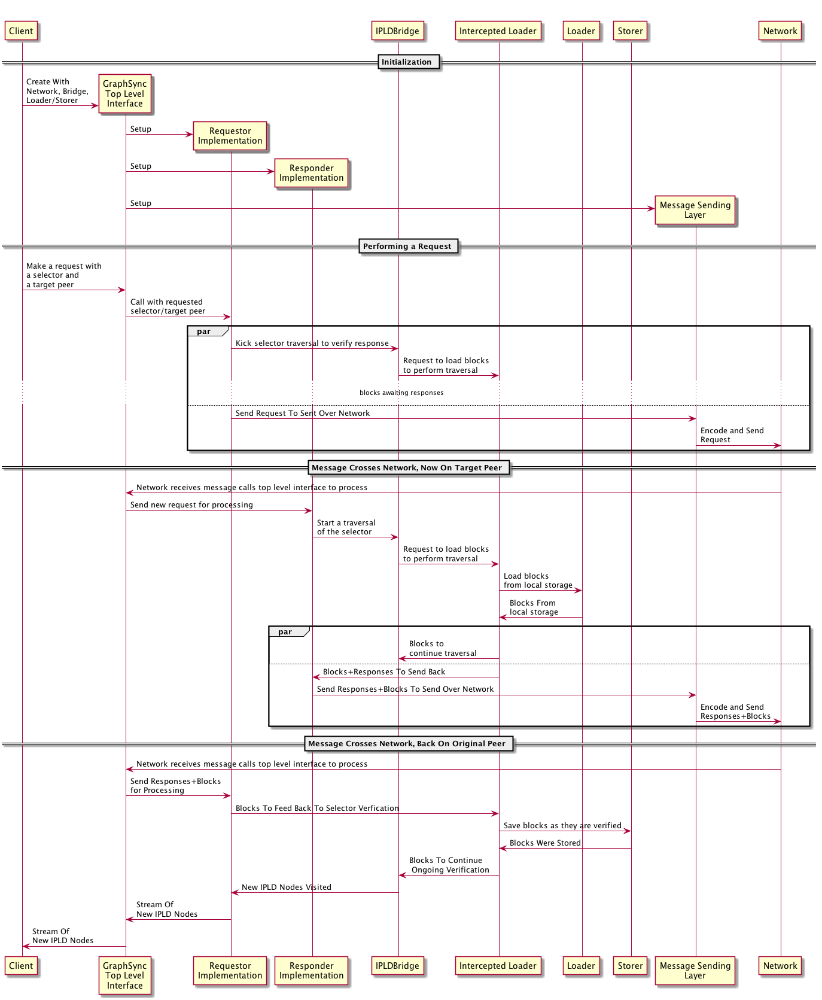
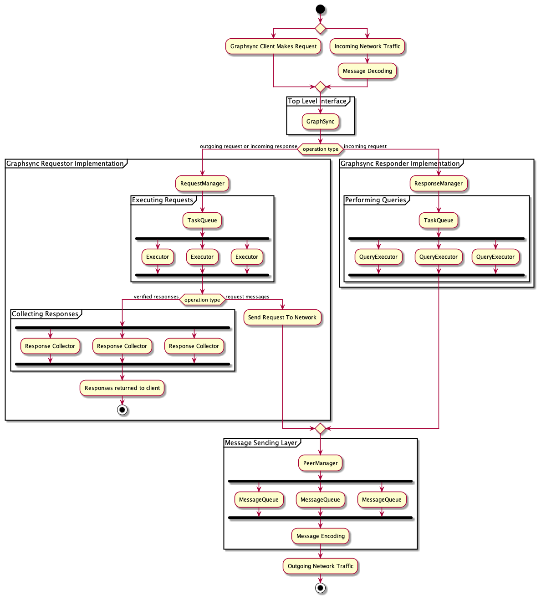
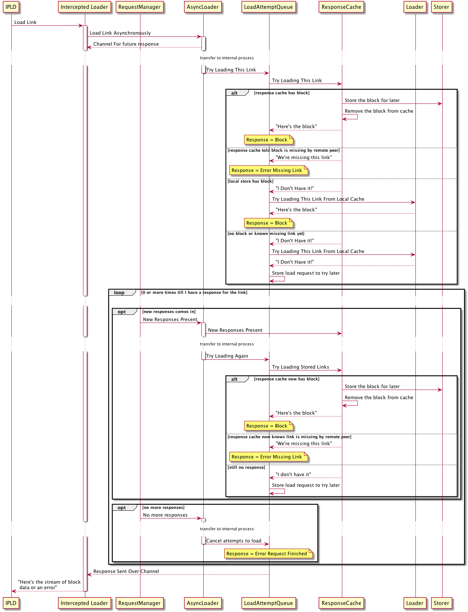
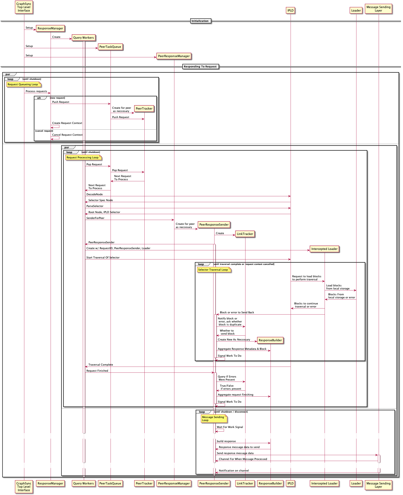

# Architecture Guide

This document explains the basic architecture for the go implementation of the GraphSync protocol. It is intended both as a guide to the code base and also to serve as a starting point for people implementing GraphSync in other languages.

## Table of Contents

- [Overview](#overview)
- [Request Lifecycle](#request-lifecycle)
- [Managing Requests And Responses](#managing-requests-and-responses)
- [Dependencies](#dependencies)
- [Requestor Implementation](#requestor-implementation)
- [Responder Implementation](#responder-implementation)
- [Message Sending Layer](#message-sending-layer)

## Overview

go-graphsync can be roughly divided into for major components.

1. The top Level interface implemented in the root module is called by a GraphSync client to initiate a request or as incoming GraphSync related messages are received from the network.

2. The Graphsync requestor implementation makes requests to the network and handles incoming GraphSync responses. 

3. The Graphsync responder implementation handles incoming GraphSync requests from the network and generates responses. 

4. The message sending layer manages sending messages to peers. It is shared by both the requestor implementation and the responder implementation

go-graphsync also depends on the following external dependencies:

1. A network implementation, which provides basic functions for sending and receiving messages on a network.

2. A bridge interface to `go-ipld-prime`, the library used to interact with IPLD data structures and perform selector queries. 

3. A local blockstore implementation, expressed by a `loader` function and a `storer` function. 

## Request Lifecycle

In order to make a complete round trip GraphSync request, all of the following need to happen:

- Requestor needs to encode and send the request to the responder
- Responder needs to receive the request, and perform an IPLD Selector query
based on it
- Responder needs to load blocks from local storage so that IPLD can perform the selector query
- Responder needs to encode and send blocks traversed and metadata about the traversal to the requestor
- Requestor needs to verify the blocks received are actually the right ones for the selector query requested. To do that it performs Selector Query locally, feeding it responses from the network.
- Requestor needs to store blocks it receives once they are verified
- Requestor needs to return traversed nodes to the Graphsync caller

This order of these requirements corresponds roughly with the sequence they're executed in time.

However, if you reverse the order of these requirements, it becomes clear that a GraphSync request is really an IPLD Selector Query performed locally that happens to be be backed by another remote peer performing the same query on its machine and feeding the results to the requestor.

Selector queries, as implemented in the `go-ipld-prime` library, rely on a loader function to load data any time a link boundary is crossed during a query. The loader can be configured each time a selector query is performed. We use this to support network communication on both sides of a GraphSync query.

On the requestor side, instead of supplying the local storage loader, we supply it with a different loader that waits for responses from the network -- and also simultaneously stores them in local storage as they are loaded. Blocks that come back on the network that are never loaded as part of the local Selector traversal are simply dropped. Moreover, we can take advantage of the fact that blocks get stored locally as they are traversed to limit network traffic -- there's no need to send back a block twice because we can safely assume in a single query, once a block is traversed once, it's in the requestors local storage.

On the responder side, we employ a similar method -- while an IPLD Selector query operate at the finer grain of traversing IPLD Nodes, what we really care about is when they it crosses a link boundary. At this point IPLD asks the Loader to load the link, and here, we provide IPLD with a loader that wraps the local storage loader but also transmits every block loaded across the network.

So, effectively what we are doing is using intercepted loaders on both sides to handle the transmitting and receiving of data across the network.

While the actual code operates in a way that is slightly more complicated, the basic sequence of a single GraphSync request is as follows:

## Managing Requests and Responses

Having outlined all the steps to execute a single roundtrip Graphsync request, the primary architectural challenge of GraphSync is to handle processing multiple requests and responses simultaneously. Ideally while handling multiple requests and responses, GraphSync should:
- continue to operate smoothly and efficiently
- minimize network traffic and not send duplicate data
- not get blocked if any one request or response becomes blocked for whatever reason
- have ways of protecting itself from getting overwhelmed by a malicious peer (i.e. be less vulnerable to Denial Of Service attacks)

To do this, GraphSync maintains several independent threads of execution (i.e. goroutines). Specifically:
- On the requestor side:
1. We maintain an independent thread to make and track requests (RequestManager)
2. We maintain an independent thread to feed incoming blocks to selector verifications (AsyncLoader)
3. Each outgoing request has an independent thread performing selector verification
4. Each outgoing request has an independent thread collecting and buffering final responses before they are returned to the caller. Graphsync returns responses to the caller through a channel. If the caller fails to immediately read the response channel, this should not block other requests from being processed.
- On the responder side:
1. We maintain an independent thread to receive incoming requests and track outgoing responses. As each incoming request is received, it's put into a prioritized queue.
2. We maintain fixed number of threads that continuosly pull the highest priority request from the queue and perform the selector query for that request
3. Each peer we respond to has an independent thread marshalling and deduplicating outgoing responses and blocks before they are sent back. This minimizes data sent on the wire and allows queries to proceed without getting blocked by the network.
- At the messaging layer:
1. Each peer we send messages to has an independent thread collecting and buffering message data while waiting for the last message to finish sending. This allows higher level operations to execute without getting blocked by a slow network

The following diagram illustrates concurrent threads operating as a client makes calls to GraphSync and messages arive from the network:

The remaining sections of this document outline internal workings of major graphsync components in more detail. 

## Dependencies

### Network Implementation

The network implementation needs to provide basic lower level utilties for sending and receiving messages. A default implementation using `libp2p` is included in the package, and a mock version is provided for testing. 

### Bridge To IPLD

Rather than interact with `go-ipld-prime` directly, `go-graphsync` makes calls via a bridge interface provided as a dependency. During the initial development of `go-graphsync`, key components of `go-ipld-prime` were not finished or changing rapidly. The bridge provides a way to keep the interfaces somewhat stable from `go-graphsyncs` standpoint, and a mechanism to provide a mock version of go-ipld-prime for testing. This allowed `go-graphsync` to be written at the same time as `go-ipld-prime`. As `go-ipld-prime` stabilizes, it might make sense to remove this interface, though it is still useful for test isolation. The library provides a default bridge as well as a mock bridge.

### Local Blockstore Implementation

Interacting with a local blockstore is expressed by a `loader` function and a `storer` function. The `loader` function takes an IPLD Link and returns an `io.Reader` for corresponding block data, while the `storer` takes a Link and returns a `io.Writer` to write corresponding block data, plus a commit function to call when the data is ready to transfer to permanent storage.

## Requestor Implementation

The requestor implementation consists of the RequestManager which makes and tracks requests and the AsyncLoader subsystem which manages incoming responses. These systems work in concert to verify responses by performing a local selector traversal that is backed by network response data.

When a request is initiated, the RequestManager sends the request across the network, begins tracking it, initiates a query to verify the responses from the network, and initiates a thread to ultimately collect and return verified data to the caller. Most of these processes are straightforward, but verifying the response is not simple. We need to execute an IPLD selector query backed by network data, which will arrive asynchronously and potentially out of order.

To accomplish this, we delegate to the AsyncLoader, which is responsible for ingesting responses from the network, and providing them to the local IPLD selector traversal operation as it loads links.

The AsyncLoader needs to take in blocks and response metadata from the network, put that data in an in-memory cache until either:

- The local traversal actually requests that data, which validates the block, and therefore tells the async loader it can move to permanent storage.
- The local traversal completes, at which point, any blocks that haven't been verified can be dropped, cause they've been shown not to be the correct responses.

The AsyncLoader has to also manage requests for link-loads coming in form the local traversal, which may come in before OR after the relevant blocks are received from the network. Moreover, if a block is already in local storage for whatever reason, there's no need to hold up the local traversal on a network response.

The following process outlines the basic process for loading links asynchronously from the network:

The main components that make up the AsyncLoader are:

* The UnverifiedBlockStore -- basically just a temporary cache to hold blocks, and write them to permaneant storage as they are verified
* The ResponseCache -- essentially just the UnverifiedBlockStore + some link tracking, so that the BlockStore is properly pruned as requests expire
* The LoadAttemptQueue -- Basically a queue to track attempts to load links. A link load can have one of three results --
  - It can load successfully,
  - It can load and knowingly fail (i.e responder tells you it is for sure missing a link)
  - It can be indeterminate -- you don't yet have the block in the response cache or in local storage, but the responder is still sending responses and hasn't indicated it doesn't have the block.

The load attempt queue essentially attempts the load then if the response is 3, puts the load attempt in a paused queue awaiting more responses (note if the responder eventually finishes without ever sending a response for that link, the request will error at the point the last response is sent)

With the AsyncLoader handling the complicated parts of loading data from the network, the RequestManager simply manages the overall process.

## Responder Implementation

To respond to a request, the responder implementation needs to:

* Decode the selector
* Initiate a selector traversal with go-ipld-prime
* Provide ipld-prime with an overloaded link loader
* Whenever IPLD prime loads a link during traversal, use the intercepted loader to send a message across the network to the requestor with the block and/or metadata about the block
* Terminate the response

In addition, an optimized responder implementation accounts for the following concerns:

* *"Don't get DDOS'd"* - a denial of service attack should not be trivially easy. Selector traversal carries a non-trivial CPU and memory cost, so the responder needs to take care not to simply execute every graphsync query it receives immediately.

* *Preserve Bandwith* - Be efficient with network usage, dedepulicate data, and buffer response output so that each new network message contains all response data we have at the time the pipe becomes free.

The responder implementation is managed by the Response Manager. The ResponseManager delegates to PeerTaskQueue to rate limit the number of in progress selector traversals and ensure no one peer is given more priority than others. As data is generated from selector traversals, the ResponseManager uses the PeerResponseManager to aggregate response data for each peer and send compact messages over the network.

The follow diagram outlines in greater detail go-graphsync's responder implementation, covering how it's initialized and how it responds to requests:

Here are some key components in this implementation:

### PeerTaskQueue - Preventing DOS Attacks

Rather than responding to incoming requests immediately, the ResponseManager places each incoming request in a prioritized queue. 

The queue here is a generalized implementation of the PeerRequestQueue in Bitswap (called the PeerTaskQueue). The PeerTaskQueue first balances peers so that those with the most current in progress requests are prioritized after those with fewer in progress requests, and then within a peer prioritizes the requests with highest priority or earliest received.

Meanwhile, the ResponseManager starts a fixed number of workers (currently 6), each of which continually pull the highest priority job off the queue, process the traversal and send the response. So at any given time, only a fixed number of selector queries are executing on the node.

The net here is that no peer can have more than a fixed number of requests in progress at once, and even if a peer sends infinite requests, other peers will still jump ahead of it and get a chance to process their requests.

### Peer Response Sender -- Deduping blocks and data

Once a request is dequeued, we generate an intercepted loader and provide it to go-ipld-prime to execute a traversal. Each call to the loader will generate a block that we either have or don't. We need to transmit that information across the network. However, that information needs to be encoded in the GraphSync message format, and combined with any other responses we may be sending to the same peer at the same time, ideally without sending blocks more times than neccesary.

These tasks are generally managed by the PeerResponseManager which spins up one PeerResponseSender for each peer. The PeerResponseSender tracks links with the LinkTracker and aggregates responses with the ResponseBuilder. Everytime the PeerResponseSender is called by the intercepted loader, it users the LinkTracker and ResponseBuilder to add block information and metadata to the response. Meanwhile, the PeerResponseSender runs a continuous loop that is synchronized with the message sending layer -- a new response is aggregated until the message sending layer notifies that the last message was sent, at which point the new response is encoded and sent.

## Message Sending Layer

The message sending layer is the simplest major component, consisting of a PeerManager which tracks peers, and a message queue for each peer. The PeerManager spins up new new message queues on demand. When a new request is received, it spins up a queue as needed and delegates sending to the message queue which collects message data until the network stream is ready for another message. It then encodes and sends the message to the network
