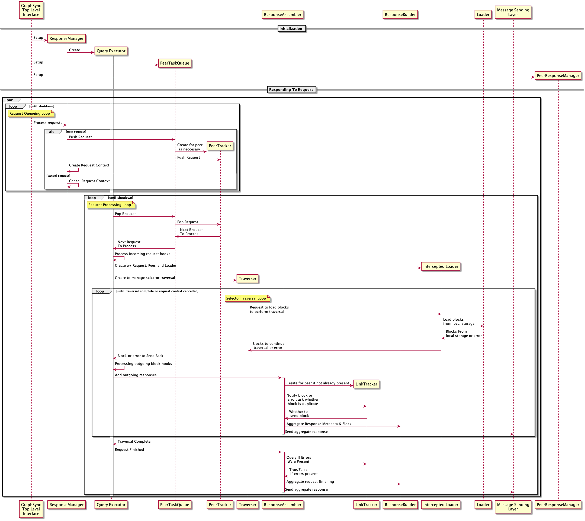

# Architecture Guide

This document explains the basic architecture for the go implementation of the GraphSync protocol. It is intended both as a guide to the code base and also to serve as a starting point for people implementing GraphSync in other languages.

## Table of Contents

- [Overview](#overview)
- [Request Lifecycle](#request-lifecycle)
- [Managing Requests And Responses](#managing-requests-and-responses)
- [Dependencies](#dependencies)
- [Requestor Implementation](#requestor-implementation)
- [Responder Implementation](#responder-implementation)
- [Message Sending Layer](#message-sending-layer)
- [Miscellaneous](#miscellaneous)

## Overview

go-graphsync can be roughly divided into four major components.

1. The top Level interface implemented in the root module is called by a GraphSync client to initiate a request or as incoming GraphSync related messages are received from the network.

2. The Graphsync requestor implementation makes requests to the network and handles incoming GraphSync responses. 

3. The Graphsync responder implementation handles incoming GraphSync requests from the network and generates responses. 

4. The message sending layer manages to send messages to peers. It is shared by both the requestor implementation and the responder implementation

go-graphsync also depends on the following external dependencies:

1. A network implementation, which provides basic functions for sending and receiving messages on a network.

2. A local blockstore implementation, expressed by an IPLD `LinkSystem`. 

## Request Lifecycle

In order to make a complete round trip GraphSync request, all of the following need to happen:

- Requestor needs to encode and send the request to the responder
- Responder needs to receive the request, and perform an IPLD Selector query
based on it
- Responder needs to load blocks from local storage so that IPLD can perform the selector query
- Responder needs to encode and send blocks traversed and metadata about the traversal to the requestor
- Requestor needs to verify the blocks received are actually the right ones for the selector query requested. To do that it performs Selector Query locally, feeding it responses from the network.
- Requestor needs to store blocks it receives once they are verified
- Requestor needs to return traversed nodes to the Graphsync caller

This order of these requirements corresponds roughly with the sequence they're executed in time.

However, if you reverse the order of these requirements, it becomes clear that a GraphSync request is really an IPLD Selector Query performed locally that happens to be backed by another remote peer performing the same query on its machine and feeding the results to the requestor.

Selector queries, as implemented in the `go-ipld-prime` library, rely on a function to load data any time a link boundary is crossed during a query. The loader can be configured each time a selector query is performed. We use this to support network communication on both sides of a GraphSync query.

On the requestor side, instead of supplying a function to read from local storage, we supply a function that waits for responses from the network -- and also simultaneously stores them in local storage as they are loaded. Blocks that come back on the network that are never loaded as part of the local Selector traversal are simply dropped. Moreover, we can take advantage of the fact that blocks get stored locally as they are traversed to limit network traffic -- there's no need to send back a block twice because we can safely assume in a single query, once a block is traversed once, it's in the requestors local storage.

On the responder side, we employ a similar method -- while an IPLD Selector query operates at the finer grain of traversing IPLD Nodes, what we really care about is when it crosses a link boundary. At this point, IPLD calls out to a function to load the link, and here, we provide IPLD with a function that loads from local storage but also transmits every block loaded across the network.

So, effectively what we are doing is using intercepted block loaders on both sides to handle the transmitting and receiving of data across the network.

While the actual code operates in a way that is slightly more complicated, the basic sequence of a single GraphSync request is as follows:

## Managing Requests and Responses

Having outlined all the steps to execute a single roundtrip Graphsync request, the primary architectural challenge of GraphSync is to handle processing multiple requests and responses simultaneously. Ideally while handling multiple requests and responses, GraphSync should:
- continue to operate smoothly and efficiently
- minimize network traffic and not send duplicate data
- not get blocked if any one request or response becomes blocked for whatever reason
- have ways of protecting itself from getting overwhelmed by a malicious peer (i.e. be less vulnerable to Denial Of Service attacks)
- manage memory effectively when executing large queries on either side

To do this, GraphSync maintains several independent threads of execution (i.e. goroutines). Specifically:
- On the requestor side:
1. We maintain an independent thread to manage requests (RequestManager) and injest responses.
2. We maintain fixed number of threads that continuously pull the highest priority outgoing request from the queue, initiate the graphsync request on the network and perform selector verification against responses
3. Each outgoing request has an independent thread collecting and buffering final responses before they are returned to the caller. Graphsync returns responses to the caller through a channel. If the caller fails to immediately read the response channel, this should not block other requests from being processed.
- On the responder side:
1. We maintain an independent thread to receive incoming requests and track outgoing responses. As each incoming request is received, it's put into a prioritized queue.
2. We maintain fixed number of threads that continuously pull the highest priority request from the queue and perform the selector query for that request. We marshal and deduplicate outgoing responses and blocks before they are sent back. This minimizes data sent on the wire and allows queries to proceed without getting blocked by the network.
- At the messaging layer:
1. Each peer we send messages to has an independent thread collecting and buffering message data while waiting for the last message to finish sending. This allows higher level operations to execute without getting blocked by a slow network

The following diagram illustrates concurrent threads operating as a client makes calls to GraphSync and messages arrive from the network:

The remaining sections of this document outline internal workings of major graphsync components in more detail. 

## Dependencies

### Network Implementation

The network implementation needs to provide basic lower level utilities for sending and receiving messages. A default implementation using `libp2p` is included in the package, and a mock version is provided for testing. 

### Local Blockstore Implementation

Interacting with a local blockstore is expressed via an IPLD `LinkSystem`. The block loading function in an IPLD `LinkSystem` takes an IPLD Link and returns an `io.Reader` for corresponding block data, while the block storing function takes a Link and returns a `io.Writer` to write corresponding block data, plus a commit function to call when the data is ready to transfer to permanent storage.

## Requestor Implementation

The RequestManager tracks outgoing requests and processes incoming responses. When a request is initiated, the RequestManager begins tracking it, and places into the a TaskQueue. When the request becomes the highest priority task, it is executed by a request executor that runs a selector traversal backed by both our local store and the responses to a Graphsync network request. 

When a request begins execution, we load blocks from local storage until we encounter a block we don't have. Then we initiate a Graphsync network request to backfill the blocks we don't yet have. While this request is in progress, we wait for network responses to come in, then feed these blocks into the selector traversal. Blocks that loaded by the selector traversal are considered "verified" and get saved to local storage. Periodically, we will have to fall back to the local store to load a block we previously stored from the remote because remotes generally don't load blocks twice. Once the remote finishes its responses, we assume any remaining block loads must come from local storage or error.

To manage this complicated process, the RequestManager creates a ReconciledLoader for each request. 

### Reconciled Loader

The ReconciledLoader loads blocks by inteleaving two data sources: local storage, and incoming responses from the network. It also verifies that incoming remote responses match the order of links loaded by a locally executing selector.

Each ReconciledLoader contains a TraversalRecord and a Verifier. The TraversalRecord is a compact representation of an ordered history of links loaded in a traversal, along with their paths. The Verifier is a class for replaying a traversal history against a series of responses from a remote. It also handles missing links the local may have had the remote does not.

The ReconciledLoader also contains a remote queue of metadata and blocks for a given request.

The loading process is as follows:

- when we request a link, we wait for new items from the remote
   - if we're offline, we return immediately
   - if we're online, we wait until we have new items to read
      - when we first go online, we initiate a "verification" against previous loaded data -- this comes from the traversal record
      - this means when we first go online, we actually don't have any "new" remote items until the verification finishes. if the verification fails, we actually pass as an error in response to the load request -- this is a bit odd, but keep in mind the traverser that calls BlockReadOpener will simply throw this in the graphsync error channel and close the request. I really didn't want to deal with having the channel inside the reconciled loaded and getting drawn request closing process.
- if we have new remote items, and we're not loading from a path we know the remote is missing, we attempt to load the link from the first remote item, erroring if the link we're loading and the remote do no match
- if we're on a path the remote is missing, we simply go right too loading local
- if the remote sent the block, it's directly in the remote item queue and we save and return it.
- if the remote said it had the block but it was a duplicate, we load local
if the remote said its missing the block, we record the new missing path, then load local
- Once we load, we actually hold till the next load before putting the link in the traversal record. This enables a "retry" to be run when local load fails but then the node goes online

Injesting data is handled by the ResponseManager and is very straightforward -- we add divide up responses and blocks by request ID and then queue responses into the respective queues for the ReconciledLoader. Coordination is simply handled via mutexes and sync.Cond for signalling.

The following diagram demonstrates step by step how request execution works:

## Responder Implementation

To respond to a request, the responder implementation needs to:

* Decode the selector
* Initiate a selector traversal with go-ipld-prime
* Provide ipld-prime with an overloaded link loader
* Whenever IPLD prime loads a link during traversal, use the intercepted loader to send a message across the network to the requestor with the block and/or metadata about the block
* Terminate the response

In addition, an optimized responder implementation accounts for the following concerns:

* *"Don't get DDOS'd"* - a denial of service attack should not be trivially easy. Selector traversal carries a non-trivial CPU and memory cost, so the responder needs to take care not to simply execute every graphsync query it receives immediately.

* *Preserve Bandwith* - Be efficient with network usage, deduplicate data, and buffer response output so that each new network message contains all response data we have at the time the pipe becomes free.

The responder implementation is managed by the Response Manager. The ResponseManager delegates to TaskQueue and QueryExecutor to manage selector traversals. The TaskQueue rate limits the number of in progress selector traversals and ensures no one peer is given more priority than others. As data is generated from selector traversals, the QueryExecutor uses the ResponseAssembler to aggregate and send messages to the message sending layer.

The following diagram outlines in greater detail go-graphsync's responder implementation, covering how it's initialized and how it responds to requests:

Here are some key components in this implementation:

### TaskQueue - Preventing DOS Attacks

Rather than responding to incoming requests immediately, the ResponseManager places each incoming request in a TaskQueue. When the request becomes the highest priority task, it is executed by the Query Executor that runs a selector
traversal and sends responses.

The TaskQueue that no peer can have more than a fixed number of requests in progress at once, and even if a peer sends infinite requests, other peers will still jump ahead of it and get a chance to process their requests.

### ResponseAssembler -- Deduping blocks and data

Once a request is dequeued, we initiate a selector traversal. Each time the traversal reaches a block boundary, it will request to load the block from a loader function we provide. Our loader function will use local storage to determine if we have this block or not, but we also need to transmit that information across the network. That information needs to be encoded in the GraphSync message format, and combined with any other responses we may be sent to the same peer at the same time, ideally without sending blocks more times than necessary.

These tasks are managed by the ResponseAssembler. The ResponseAssembber creates a LinkTracker for each peer to track what blocks have been sent. Responses are sent by calling Transaction on the ResponseAssembler, which provides a ResponseBuilder interface that can be used to assemble responses. Transaction is named as such because all data added to a response by calling methods on the provided ResponseBuilder is gauranteed to go out in the name network message.

## Message Sending Layer

The message consists of a PeerManager which tracks peers, and a message queue for each peer. The PeerManager spins up new new message queues on demand. When a new request is received, it spins up a queue as needed and delegates sending to the message queue which collects message data until the network stream is ready for another message. It then encodes and sends the message to the network.

The message queue system contains a mechanism for applying backpressure to a query execution to make sure that a slow network connection doesn't cause us to load all the blocks for the query into memory while we wait for messages to go over the network. Whenever you attempt to queue data into the message queue, you provide an estimated size for the data that will be held in memory till the message goes out. Internally, the message queue uses the Allocator to track memory usage, and the call to queue data will block if there is too much data buffered in memory. When messages are sent out, memory is released, which will unblock requests to queue data for the message queue.

## Miscellaneous

### Hooks And Listeners

go-graphsync provides a variety of points in the request/response lifecycle where one can provide a hook to inspect the current state of the request/response and potentially take action. These hooks provide the core mechanisms for authenticating requests, processing graphsync extensions, pausing and resuming, and generally enabling a higher level consumer of the graphsync to precisely control the request/response lifecycle.

Graphsync also provides listeners that enable a caller to be notified when various asynchronous events happen in the request response lifecycle. Currently graphsync contains an internal pubsub notification system (see [notifications](../notifications)) to escalate low level asynchonous events back to high level modules that pass them to external listeners. A future refactor might look for a way to remove this notification system as it adds additional complexity.

### TaskQueue

In both the requestor and responder implementations, Graphsync utilizes a general prioritized task manager called a TaskQueue. The TaskQueue internally uses the same PeerTaskQueue utilized by Bitswap, that balances peers so that those with the most current in progress requests are prioritized after those with fewer in progress requests, and then within a peer prioritizes the requests with the highest priority or earliest received.

The task queue is initialized with a task executor that can execute a single task. Once initialized task queue starts a fixed number of workers (default: 6), each of which continually pulls the highest priority job off the queue, and executes it with task executor before going to the next task.

### Actor Pattern In RequestManager And ResponseManager

To manage concurrency in a predictable way, the RequestManager and the ResponseManager are informally implemented using the [Actor model](https://en.wikipedia.org/wiki/Actor_model) employed in distributed systems languages like Erlang.

Each has isolated, internal state and a semi-asynchronous message queue (just a go channel with a 16 message buffer). The internal thread takes messages off the queue and dispatches them to call methods that modify internal state. 

Each implementation is spread out across three files:
- client.go - the public interface whose methods dispatch messages to the internal thread
- server.go - the methods run inside the thread that actually process messages and modify internal state
- messages.go - the differnt messages that are sent through the main message box

To achieve the kind of dynamic dispatch one expects from the actor pattern based on message type, we use the visitor pattern to simulate sum types. (https://making.pusher.com/alternatives-to-sum-types-in-go/) This does mean the implementation is a bit verbose to say the least.

However, implementing actors provides a more predictable way to handle concurrency issues than traditional select statements and helps make the logic of complex classes like the RequestManager and ResponseManager easier to follow.